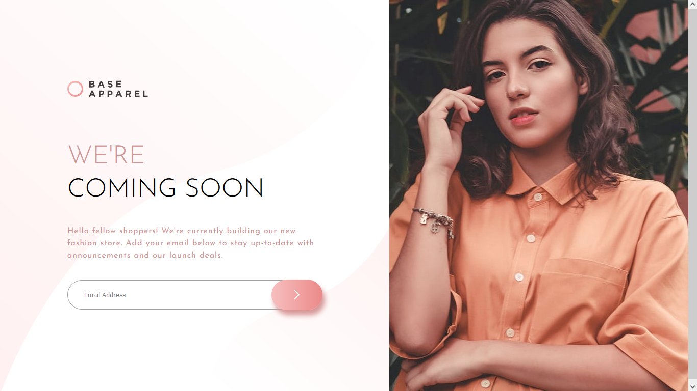
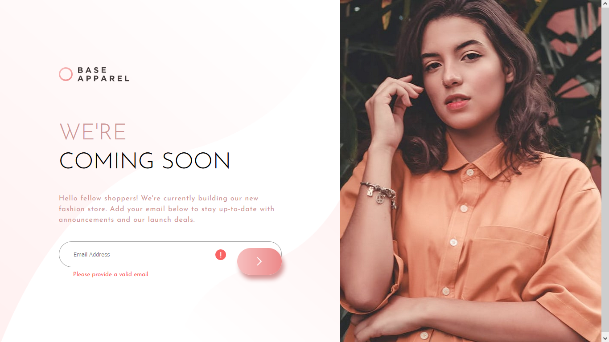
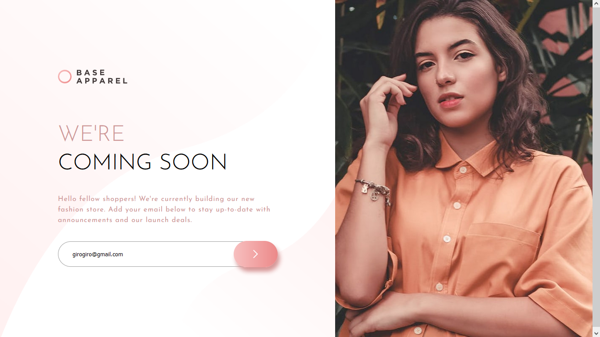
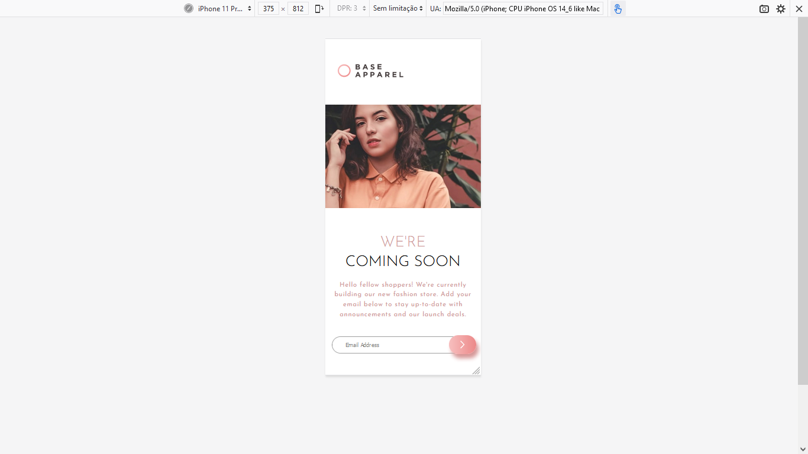

<h1>Desafio Base Apparel </h1>
 

NEste desafio do Frontend Mentor, muito semelhante ao desafio anterior, foi criado uma página de validação de email. Utilizei conhecimentos aprendidos com o ooutro desafio, e pelo visto o proximo também será um formulário. Será bom pra fixar o aprendizado.

 
<h2>Tela inicial Base Apparel</h2>
 

 
<h2>Sem completar email, ou dados inseridos errados</h2>
 

 
<h2>Email preenchido corretamente</h2>
 

 
<h2>Layout Mobile</h2>
 

 
<h3>Conclusões sobre o estudo</h3>
 

Gostei de realizar esse desafio. O HTML e o CSS fiz em um intervaçlo de temppo que achei satisfatório. Mas o JS tibve dificuldade no inicio da implementação;. Devo me atentar ao declarar variaveis e funções. 

